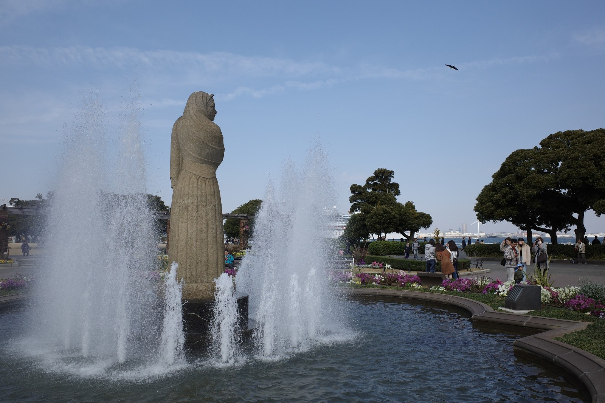
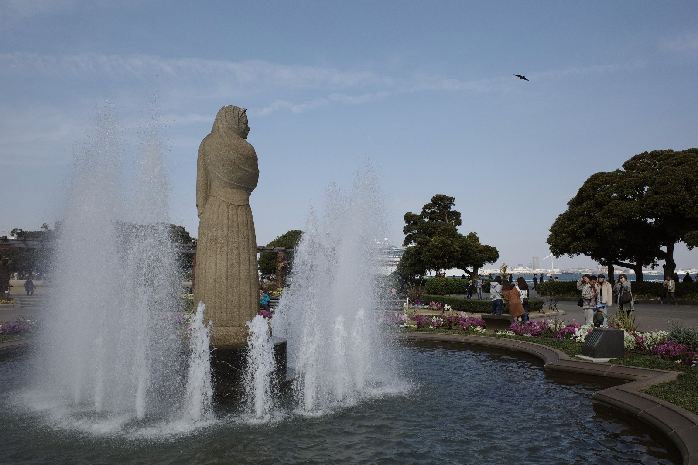
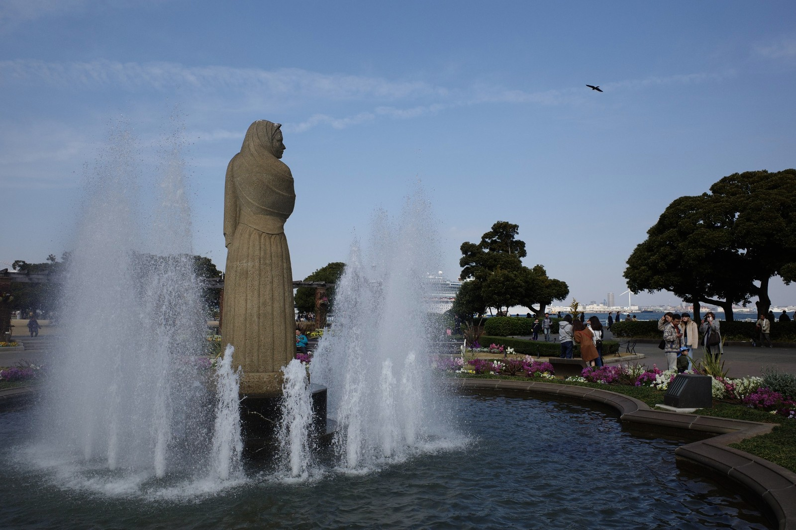
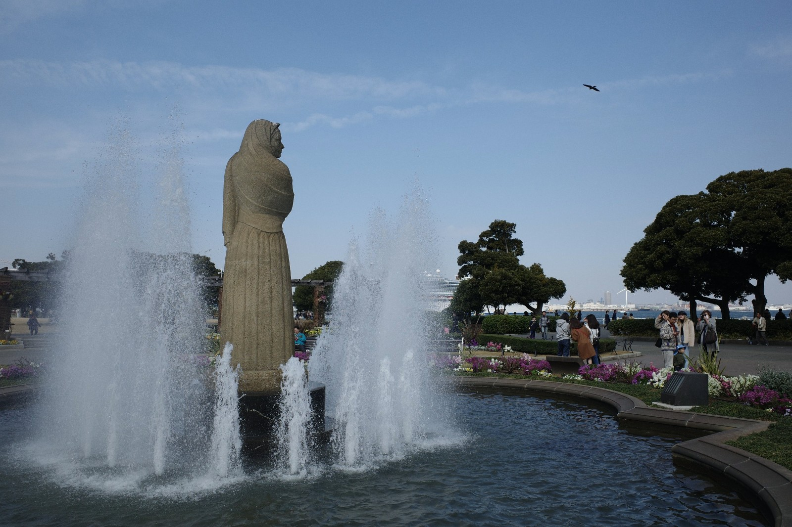
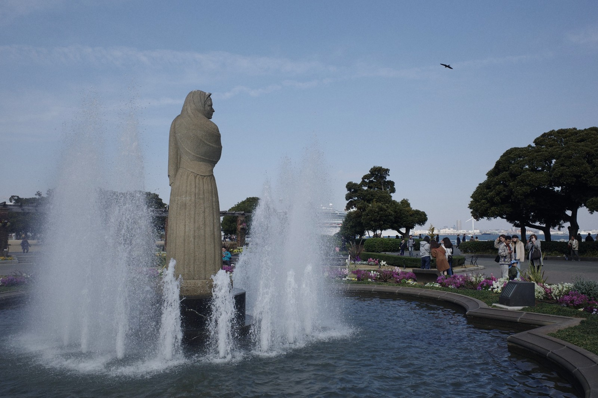
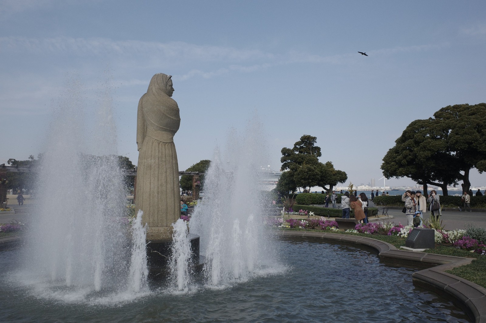
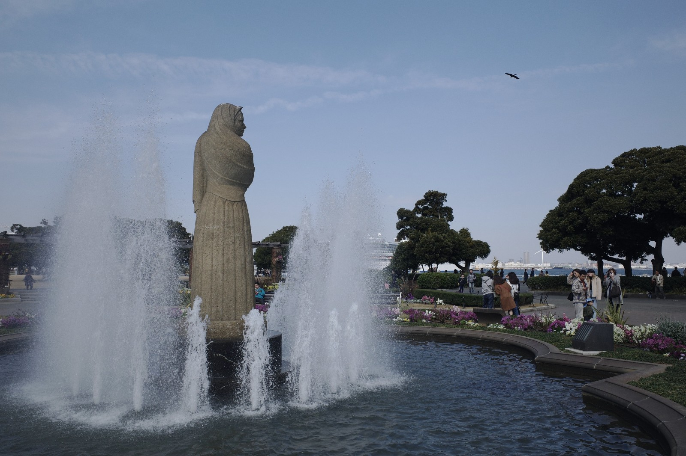
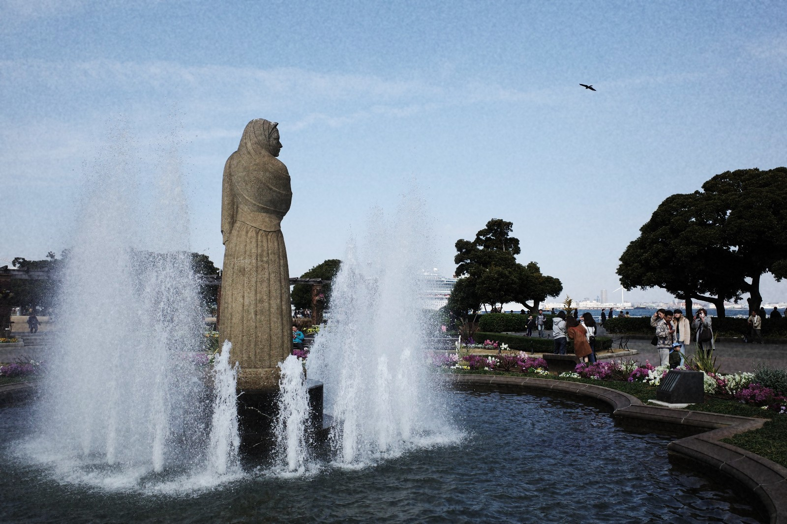
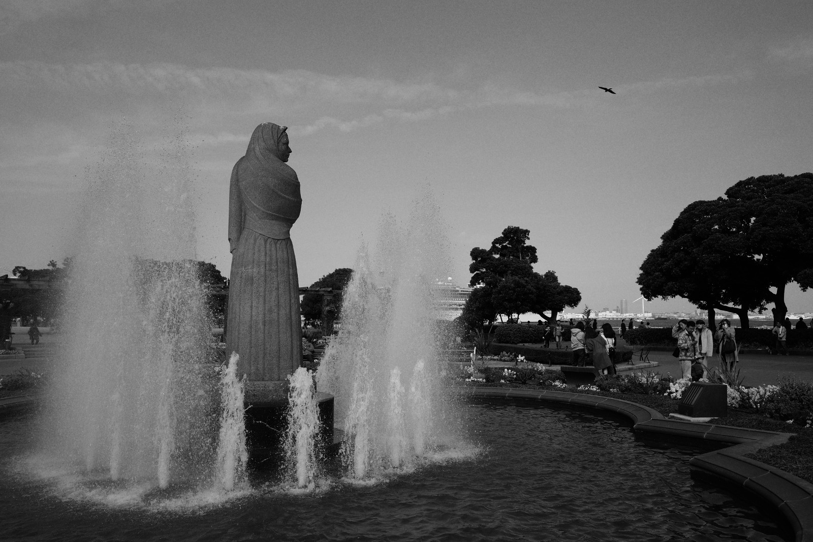
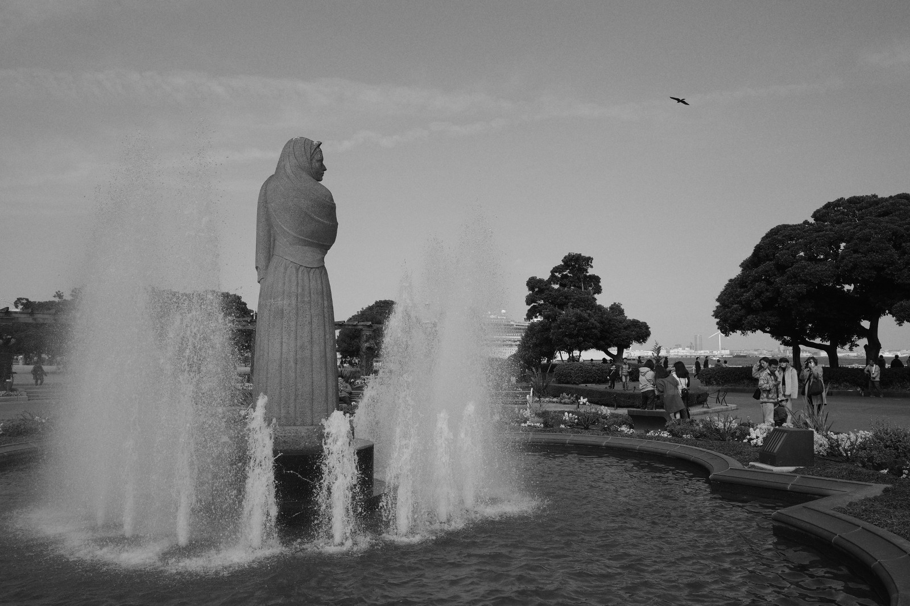

# Ricoh GR III Android Companion

[](https://github.com/Nielk74/ricoh-gr3-android/actions/workflows/build.yml)
[](https://github.com/Nielk74/ricoh-gr3-android/releases/latest)


A native Kotlin companion for the **Ricoh GR III and GR IIIx**: Bluetooth remote control,
Wi-Fi live view and photo transfer, plus a scene-aware, on-device film lab for JPEG and DNG
captures.

The app is independent and unofficial. It uses the camera's community-documented BLE GATT and
local HTTP interfaces; it does not require Ricoh's Image Sync app or a cloud account.

> **Current release: v0.9.1.** The app, protocol clients, colour-science core, update path, and
> automated tests are implemented. Real-camera radio behaviour still needs validation across GR
> III/IIIx firmware and Android vendors; see [Current limitations](#current-limitations).

## What it does

| Area | Current capability |
| --- | --- |
| Bluetooth | Scan, connect, read camera identity and WLAN credentials, cache credentials in private app storage, fire the shutter, and expose basic camera state. |
| Wi-Fi | Join the camera AP on Android 10+, route only camera traffic to it while normal internet access stays available, show MJPEG live view, fire the Wi-Fi shutter with retry, and read camera properties. |
| Library | Browse a three-column camera contact sheet, inspect metadata, distinguish RAW files, select batches, apply one finish, save the selection, and mark edited frames. |
| Auto import | Choose an original or film-look preset once, import the connected camera roll sequentially, and follow current-file plus saved/failed/remaining progress. |
| Viewer | Render the real developed preview, press and hold for before/after, choose a sticky look, adjust effect from 50–150%, select edited-export quality, reset, and save original or edited copies to `Pictures/GR3`. |
| Film Lab | Eleven provenance-labelled film/cinema looks with literal Stock and scene-protected Smart rendering, negative-to-print density, natural skin isolation, physical-scale diffusion, two-lobe halation, and film-plane grain. |
| Updates | Check GitHub Releases automatically at most once every 24 hours or manually on demand, verify the published APK SHA-256, and hand installation to Android. |

## Connection model

The GR III exposes two useful wireless planes, but the camera runs them **one at a time**:

```text
Bluetooth mode                         Wi-Fi mode
─────────────────────────────          ─────────────────────────────────
Scan and pair                          Turn Wi-Fi on from the camera body
Remote shutter + basic control         App joins the camera access point
Read/cache Wi-Fi credentials           Live view, gallery, transfer, shutter
Low power; no live view                High bandwidth; Android 10+ required
                 Change mode = disconnect the active transport
```

The reliable workflow is:

1. Pair over Bluetooth once if the app still needs the camera's SSID and passphrase.
2. Return to the connection chooser; the credentials remain cached locally.
3. Enable Wi-Fi on the camera body and choose **Wi-Fi** in the app.
4. Accept Android's network prompt, then open **Library** or **Live View**.

The reverse-engineered BLE write that should wake the camera's AP is rejected by shipping GR III
firmware, so the app does not pretend that hand-off is automatic. You currently enable Wi-Fi on
the camera yourself. The investigation is documented in
[`research/BLE_WIFI_WAKE_INVESTIGATION.md`](research/BLE_WIFI_WAKE_INVESTIGATION.md).

## Film Lab

The Film Lab is not a fixed colour overlay. **Stock** applies the authored transform without
content-dependent decisions; **Smart** adds bounded protection for high-key, backlit, low-key,
mixed-light, and high-ISO scenes, plus a very small scene-guarded warmth bias for explicitly
daylight-balanced colour stocks. Preview and export share the selected rendering intent and stable
per-photo grain seed. For JPEGs, the canonical normalized analyzer is independently evaluated at
each size and is tested to keep its decisions stable across resolution; DNG has the
device-rendering limitation documented below.

### Included looks

- Portra 400 and Portra 800
- Gold 200 and Ektar 100
- Superia 400
- CineStill 800T
- Vision3 250D and Vision3 500T
- Eterna Cinema
- Tri-X 400 and HP5 Plus

The processing order is deliberate:

```text
JPEG or platform-rendered DNG
  → Stock contract or canonical Smart analysis/protection
  → optional Smart daylight warmth (scene-guarded, luminance-stable)
  → optional film-negative exposure bracket
  → absolute negative optical density and transmittance
  → positive print density / reflectance or scanner response
  → luminance-neutral split tone
  → connected, face-gated skin naturalisation
  → selective Portra foliage and top-connected sky colour
  → physical-scale image-structure diffusion
  → immutable-source, two-lobe stock-coloured halation
  → analytically integrated film-plane density grain
  → high-quality JPEG export
```

Important details:

- **Effect intensity:** 50–150% changes the stock character and emulsion layers. Tonal
  protection is not over-amplified, so 150% does not become an HDR effect.
- **Rendering intent:** Stock is scene-invariant and suitable for calibration; Smart alone may
  adjust tone protection, semantic skin/foliage/sky handling, and the restrained daylight warmth
  described below. The choice travels with each in-session frame edit; the next-frame default is
  persisted across launches.
- **Pleasing warmth:** Smart applies a luminance-stable +6-mired Bradford adaptation before
  the negative/print transform, but only to profiles explicitly classified as daylight colour
  film. Reliable neutral samples fade the bias when a scene already has a strong warm or cool
  cast, while a pixel-level chroma/gamut guard leaves vivid boundary colours effectively
  untouched. Stock, tungsten-balanced CineStill 800T/Vision3 500T, monochrome Tri-X/HP5, and
  unspecified-balance Eterna are unchanged. This is a product rendering preference, not a claim
  of matching an Apple camera pipeline.
- **Density and provenance:** negative and print stages use explicit optical
  density/transmittance/reflectance. Every built-in names its material/process/source and remains
  labelled `MANUFACTURER_ANCHORED`; no built-in pretends to be a measurement from this app's
  camera, film batch, chemistry, or scanner.
- **Natural portraits:** an on-device face detector gates a chromaticity mask. Complexions are
  protected without globally desaturating red fabric, wood, hair, glasses, beard detail, or warm
  light.
- **Portra colour:** eligible, top-connected blue sky moves toward cyan and receives a selective
  saturation lift. Vegetation-range yellow-greens receive a more pronounced, bounded rotation
  toward cyan-green plus their own saturation lift; skin, neutrals, deep shadows, pale highlights,
  and existing cyan are excluded. Both transforms preserve luminance and compress chroma into the
  available gamut rather than clipping channels.
- **Image structure and halation:** a weak radius in film micrometres approximates published
  stock/process MTF families. Halation then derives broad red and tight orange lobes from the same
  untouched highlight source, so a first halo cannot recursively create the second.
- **Grain:** one infinite crystal field lives in physical film coordinates. Each preview/export
  pixel integrates its footprint analytically, preserving the same field and apparent crystal
  scale across resolution. Density variation peaks through low-mid/mid tones, rolls off near
  black/white, and uses larger, more irregular crystals for faster stocks. Edited JPEGs offer
  Compact (JPEG 92), High (JPEG 97), and Maximum (JPEG 100) output so file size and retained
  texture are an explicit choice.
- **DNG boundary:** Android, not this app, renders the DNG into display RGB. It is not a
  scene-linear RAW workflow and can vary by device; the viewer labels that limitation.
- **No mystery LUT pack:** the negative, print, colour-coupling, grain, and spatial models are
  authored in this repository. Stock names describe aesthetic targets, not manufacturer-certified
  colourimetry.

See the methodology in [`research/FILM_EMULATION.md`](research/FILM_EMULATION.md), the
[measurement and provenance contract](research/FILM_FIDELITY_CALIBRATION.md), the Portra grain
measurements in
[`research/PORTRA_GRAIN_CALIBRATION.md`](research/PORTRA_GRAIN_CALIBRATION.md), and the reproducible
preview workflow in [`docs/FILM_PREVIEWS.md`](docs/FILM_PREVIEWS.md).

### Generated previews

These use Smart intent at the authored 100% strength and are generated from one neutral GR III
sample through the same pure-Kotlin pipeline used by the app.

| Standard | Portra 400 | Portra 800 | Gold 200 |
|:--:|:--:|:--:|:--:|
|  |  |  |  |
| **Ektar 100** | **Superia 400** | **CineStill 800T** | **Vision3 250D** |
|  |  |  |  |
| **Vision3 500T** | **Eterna Cinema** | **Tri-X 400** | **HP5 Plus** |
|  |  |  |  |

<sub>Sample photo copyright remains with its author (RICOH GR III sample gallery). It is bundled
only to produce comparable look previews.</sub>

## Install

Download the APK from [the latest GitHub Release](https://github.com/Nielk74/ricoh-gr3-android/releases/latest),
open it on the Android device, and allow installation from that source when Android asks.

- **Android 8.0 / API 26 or newer** is supported for Bluetooth control.
- **Android 10 / API 29 or newer** is required for joining and routing traffic over the camera's
  Wi-Fi access point.
- Android 8–9 asks for legacy storage permission when saving to the shared gallery. Android 10+
  uses scoped storage.

After installation, the app checks only this repository's public GitHub Releases feed. A visible
banner appears when a newer stable APK exists, and **App update** on the home screen provides a
manual check at any time. Automatic checks remain limited to once per 24 hours. Release discovery
requests up to 100 entries at a time and follows GitHub pagination through the final page, so an
installable build cannot disappear behind later incomplete releases. Download is always
user-initiated, its SHA-256 is verified when the release publishes one, and Android still requires
confirmation before installation. Updates must be signed with the same key as the installed app.

## Use the app

### Bluetooth remote

1. Enable Bluetooth on the camera and phone.
2. Open the app, grant the requested nearby-device permission, and choose **Bluetooth**.
3. Scan, select the GR III/IIIx, and connect.
4. Use the remote shutter. The app also caches Wi-Fi credentials when the firmware exposes them.

On Android 8–11, the platform requires location permission for BLE scanning. The app does not use
that permission to track or upload location.

### Wi-Fi library and live view

1. Enable Wi-Fi from the camera menu.
2. Choose **Wi-Fi** in the app.
3. Join with the remembered credentials, or use the currently connected camera network.
4. Open **Auto import** to choose the filter, intensity, rendering, and output quality once, then
   save the whole camera roll with live per-frame progress.
5. Or open **Library**, long-press frames to select a batch, choose one finish, then use **Apply
   only** or **Save N photos**. A failed frame does not stop the rest and can be retried alone.
6. Open a frame, choose a film look, hold the image to compare with the original, set 50–150%
   intensity, choose **Compact**, **High**, or **Maximum** edited-export quality, and save either
   the untouched original or a developed copy.

Original JPEG/DNG downloads are preserved byte-for-byte. Developed output is a new JPEG and never
overwrites the camera original.

## Build and verify

Requirements:

- JDK 17
- Android SDK Platform 34 and matching build tools
- macOS, Linux, or Windows with the checked-in Gradle wrapper

Build a debug APK:

```bash
./gradlew assembleDebug
```

The APK is written to `app/build/outputs/apk/debug/app-debug.apk`.

Run the same main verification used by CI:

```bash
./gradlew assembleDebug lint test
./gradlew :tools:renderPreviews
```

The colour-science module can also be tested without an Android SDK:

```bash
./gradlew :tools:test
```

### High-resolution film review

The repository includes a modern local review lab for calibration, not just tiny README
thumbnails:

```bash
./gradlew :tools:renderReviewSite
python3 -m http.server 8765 --directory build/film-review
```

Open `http://localhost:8765`. It renders every supplied JPEG/DNG scene at a 3000 px long edge and
provides:

- original, developed, split-compare, and skin-mask views;
- fit, 100%, and 200% zoom with synchronized panning;
- the real 50–150% effect range and a dedicated grain-inspection shortcut;
- real −1/0/+1 film-negative exposure renders for selected stocks;
- per-scene Keep/Tweak/Reject notes with export.

Place private calibration captures in `.references/`; generated review files remain under the
ignored `build/` directory.

## Architecture

```text
app/src/main/java/com/ricohgr3/app/
├── ble/                 GATT profile, scanner, connection and shutter controller
├── wifi/                AP join, network-bound HTTP, MJPEG and camera REST client
├── data/                Camera photo repository, models, persistence and MediaStore export
├── gallery/             Contact sheet, auto import, transfer progress, edit and save/develop flows
├── liveview/            MJPEG viewfinder state and Wi-Fi shutter
├── looks/emulation/     Colour math, density profiles, scene/skin, optics, halation and grain
├── update/              Release discovery, semantic versions, APK download and checksum
├── ui/update/           In-app update banner and progress UI
└── nav/                 Compose navigation and transport flow

tools/                   JVM preview, calibration and review-site renderers
review-site/             Responsive high-resolution comparison interface
research/                Protocol and colour-science investigations
docs/                    Product plans, look design and generated preview documentation
```

Core technology:

- Kotlin 2 and Jetpack Compose / Material 3
- OkHttp for the local camera API, MJPEG transport, and release downloads
- Android BLE APIs and `WifiNetworkSpecifier`
- Kotlin Serialization and DataStore
- ML Kit face detection, bundled for on-device skin isolation
- Pure-Kotlin, Android-free colour math shared with the JVM render/test tools
- Min SDK 26; compile and target SDK 34

## Testing boundary

Automated coverage includes:

- BLE payload and controller-state tests;
- camera HTTP models, fixtures, and MockWebServer integration;
- MJPEG frame parsing;
- gallery/edit persistence, transfer coordination, and viewer/batch/auto-import save logic;
- canonical scene adaptation, LUT domains/interpolation, negative/print density, B&W capture
  response, exact colour/luminance behavior, skin masks, selective sky/foliage, physical-scale
  diffusion, immutable-source halation, and resolution-independent grain;
- paginated semantic-version selection, draft/prerelease filtering, and update download checks;
- reproducible README and 3000 px review renders.

CI runs `assembleDebug`, Android lint, the test suites, and film-preview generation on every
push and pull request. These checks prove the software paths; they cannot prove BLE/Wi-Fi radio
behaviour on every physical camera and phone.

## Privacy and security

- Photos are downloaded from the camera's local access point and developed on the phone.
- The app does not upload photos or edit data to a cloud service.
- Camera credentials are stored in private app DataStore.
- The automatic update check contacts GitHub's public Releases API no more than once per 24 hours;
  an explicit **Check again** action makes an additional user-requested call.
- Release APKs are checksum-verified when possible and still subject to Android's same-signing-key
  and user-confirmation rules.

## Current limitations

- The wireless protocol is unofficial and reverse-engineered; a camera firmware update can change
  behaviour.
- Bluetooth and Wi-Fi control are mutually exclusive on the camera.
- BLE credentials can be read, but the known remote Wi-Fi wake write is rejected by tested GR III
  firmware. Enable Wi-Fi on the body.
- Wi-Fi joining and camera HTTP behaviour still need physical validation across GR III/IIIx
  firmware versions and Android OEM networking stacks.
- Live view does not yet provide tap-to-focus or the complete exposure-control surface.
- CPU film development is the portable baseline and can take time on older phones. A future AGSL
  path can accelerate preview.
- Edited development is selectable: Compact caps work at 1.5 MP / JPEG 92; High retains the former
  6 MP / JPEG 97 behaviour; Maximum uses JPEG 100 and removes the fixed resolution cap. Every mode
  still obeys a heap-aware safety ceiling (roughly 1.6 MP on a 128 MiB heap, 3.1 MP on 256 MiB,
  6.3 MP on 512 MiB, and 12.6 MP on 1 GiB). The original 24 MP JPEG/DNG remains available and can
  always be saved untouched.
- The working bitmap and edited export remain 8-bit sRGB/ARGB_8888 and JPEG. A high-bit-depth,
  scene-linear, wide-gamut path is still required before this is a reference RAW developer.
- DNG rendering uses Android's platform `ImageDecoder` on API 28+ and therefore varies by device.
  Edited DNG save is disabled on API 26–27; if a newer device cannot render a particular DNG, the
  app reports that failure and directs the user to **Save original** instead of silently labelling
  untouched sensor data as an edited result.
- Built-in stock values are manufacturer-anchored visual fits. Traceable stock/process/scan
  measurements and held-out validation are still required for lab-measured fidelity claims.
- The Settings route, onboarding polish, and instrumented on-device end-to-end suite are not yet
  complete.

## Documentation

| Document | Purpose |
| --- | --- |
| [`CHANGELOG.md`](CHANGELOG.md) | User-visible release changes |
| [`ROADMAP.md`](ROADMAP.md) | Living implementation plan and remaining hardware/product work |
| [`research/FEASIBILITY.md`](research/FEASIBILITY.md) | GR III wireless protocol feasibility |
| [`research/BLE_WIFI_WAKE_INVESTIGATION.md`](research/BLE_WIFI_WAKE_INVESTIGATION.md) | Why automatic BLE-to-Wi-Fi wake is not shipped |
| [`docs/PHASE7-LOOKS.md`](docs/PHASE7-LOOKS.md) | Film Lab product and processing design |
| [`research/FILM_EMULATION.md`](research/FILM_EMULATION.md) | Colour-science model and implementation |
| [`research/FILM_FIDELITY_CALIBRATION.md`](research/FILM_FIDELITY_CALIBRATION.md) | Measurement, provenance, fitting, and validation contract |
| [`research/PORTRA_GRAIN_CALIBRATION.md`](research/PORTRA_GRAIN_CALIBRATION.md) | Portra 400/800 grain evidence and targets |
| [`docs/FILM_PREVIEWS.md`](docs/FILM_PREVIEWS.md) | Reproducible preview and review-lab workflow |
| [`RELEASING.md`](RELEASING.md) | Signing, versioning, checksums, tags, and in-app updates |

## Releases

Pushing a `v*` tag runs the release workflow. The tag becomes `versionName`; GitHub Actions builds
and verifies the APK/AAB after tests, lint, and preview-drift checks; release signing secrets are
required. It writes the APK SHA-256 and publishes all three files to GitHub Releases. See
[`RELEASING.md`](RELEASING.md) before cutting a tag, especially because future Android updates
must use the same signing key.
