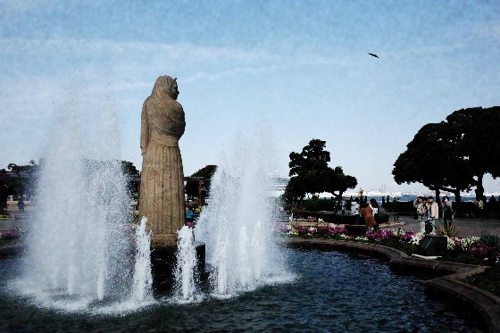
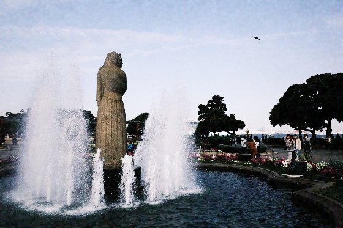
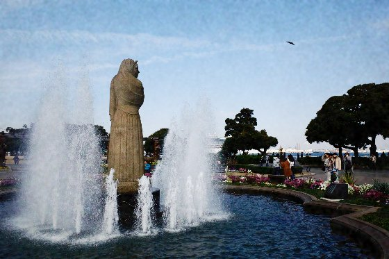
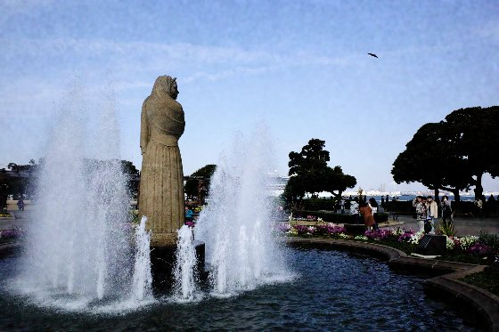
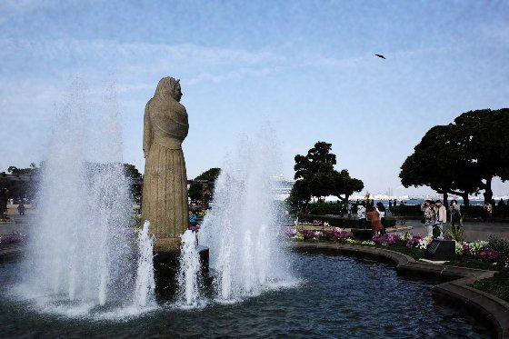
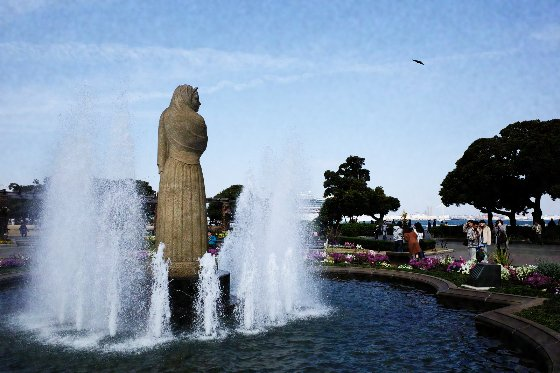
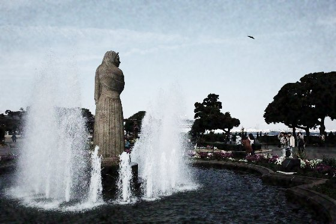

# Ricoh GR III — Android Companion App

[](https://github.com/Nielk74/ricoh-gr3-android/actions/workflows/build.yml)

An Android app to connect to and control the **Ricoh GR III / GR IIIx** (griii) camera
wirelessly: remote shutter, live view, settings control, and photo transfer.

> **Status:** BLE remote-shutter proof of concept working. See [`ROADMAP.md`](ROADMAP.md) for
> the full living plan and [`research/FEASIBILITY.md`](research/FEASIBILITY.md) for the protocol analysis.

## TL;DR — Is this feasible?

**Yes.** The GR III exposes two wireless control planes that are well understood by the
community:

- **Wi-Fi** — the camera runs an HTTP REST API at `http://192.168.0.1/v1/` (capture,
  live view MJPEG stream, settings, photo listing/download). Fully documented via
  reverse engineering.
- **Bluetooth Low Energy (BLE)** — GATT services for remote shutter, exposure settings,
  GPS geotagging, battery, and **waking up Wi-Fi remotely**. Exact service/characteristic
  UUIDs are known.

No official Ricoh SDK is required (though one exists for Pentax bodies). Everything can be
built on standard Android APIs: `HttpURLConnection`/OkHttp + `android.bluetooth.le`.

See [`research/FEASIBILITY.md`](research/FEASIBILITY.md) for the full analysis, and
[`research/references/`](research/references/) for cloned protocol specs.

## Film emulations

The app develops captured photos on-device through a real film-emulation engine (3D LUT + film
tone/colour + split-tone + halation + a physically-motivated grain model). The previews below are
rendered by CI from **one neutral, unedited GR III sample** through the **exact same pipeline** the
app ships, so they're an honest preview of each look — see
[`docs/FILM_PREVIEWS.md`](docs/FILM_PREVIEWS.md) for how they're generated.

| Standard (as shot) | Provia | Velvia | Astia |
|:--:|:--:|:--:|:--:|
|  |  |  |  |
| **Classic Chrome** | **Classic Neg** | **Nostalgic Neg** | **Eterna** |
|  |  |  |  |
| **Pro Neg Hi** | **Pro Neg Std** | **Reala Ace** | **Bleach Bypass** |
|  |  |  |  |

<sub>Sample photo © its author (RICOH GR III sample gallery); film-simulation LUTs from
[`abpy/FujifilmCameraProfiles`](https://github.com/abpy/FujifilmCameraProfiles). Included for
preview/illustration; see [`docs/FILM_PREVIEWS.md`](docs/FILM_PREVIEWS.md) for licensing notes.</sub>

## Recommended architecture

```
BLE (always-on, low power)          Wi-Fi (on-demand, high bandwidth)
────────────────────────            ─────────────────────────────────
• Discover & pair camera            • Live view (MJPEG stream)
• Remote shutter + AF               • Full settings control
• Read battery / status             • Browse & download photos (JPEG/RAW)
• Geotagging (push phone GPS)       • Firmware-level camera props
• Wake Wi-Fi / hand off  ──────────▶
```

BLE for lightweight, always-connected control; use it to trigger the camera's Wi-Fi AP
when you need live view or bulk transfer, then talk HTTP.

## Tech stack (proposed)

- Kotlin + Jetpack Compose
- OkHttp for the `/v1/` REST API and MJPEG live view
- `android.bluetooth.le` (Nordic BLE library optional) for the GATT layer
- Min SDK 26+ (camera officially supports Android 13 via Image Sync)
